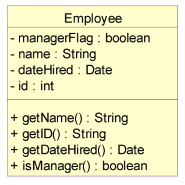

# JLAObjective3
Question 3:

You have been tasked to modify a human resources application. The current Employee class looks like this:

Currently everyone is an Employee and some of those are Managers, which is determined by calling the isManager() method. The company has now started hiring part-time employees, so the system must be modified to keep track of them.
 
Create a new implementation of the Employee class which provides the flexibility required to support the new part-time employee notion. You are free to refactor this class as required and add additional classes if needed. Describe your rationale for making the changes in the javadoc of the new Employee class. If you create any new classes, include your reasons for creating the class in its javadoc.

ANSWER: I simply added another boolean flag: boolean partTimeFlag  because the requirements only state that an employee may be part-time. However, it does not specify that a part-time employee cannot also be a manager.
See the Employee Class
